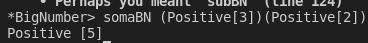
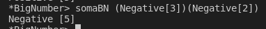
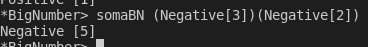

# PFL-PROJECT

### CASOS DE TESTE

#### SOMA

##### Sinais
> 1. Soma de 2 dígitos Positivos

> 2. Soma de 1 dígito Negativo com 1 dígito Negativo

> 3. Soma de 1 dígito Positivo com 1 dígito Negativo

> 4. Soma de 2 dígitos Negativos

#### Soma de números com quantidades diferentes de dígitos
> 5. Soma de número x com número y , onde x tem mais dígitos
> 
> 6. Soma de número x com número y , onde y tem mais dígitos
> 
> 7. Soma de números com número igual de dígitos
> 

#### SUBTRAÇÃO
> 1. Subtração de um dígito Negativo por um Positivo

> 2. Subtração de um dígito Positivo por um Negativo

> 3. Soma de 1 dígito Positivo com 1 dígito Negativo

> 4. Soma de 2 dígitos Negativos

#### MULTIPLICAÇÃO

| Name             | E-Mail              |
| ---------------- |-------------------- |
| Sofia Germer     | up201907461@up.pt   |
| Miguel Lopes     | up201704590@up.pt   |