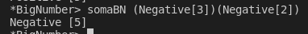
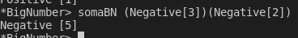

# PFL-PROJECT

### CASOS DE TESTE

#### SOMA

> 1. Soma de 2 dígitos Positivos

> 2. Soma de 1 dígito Negativo com 1 dígito Negativo

> 3. Soma de 1 dígito Positivo com 1 dígito Negativo

> 4. Soma de 2 dígitos Negativos

#### SUBTRAÇÃO

#### MULTIPLICAÇÃO

| Name             | E-Mail              |
| ---------------- |-------------------- |
| Sofia Germer     | up201907461@up.pt   |
| Miguel Lopes     | up201704590@up.pt   |